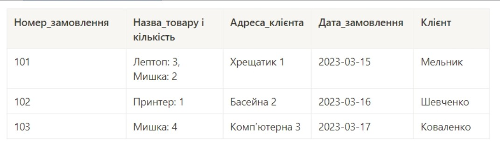
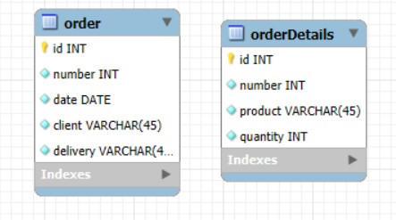
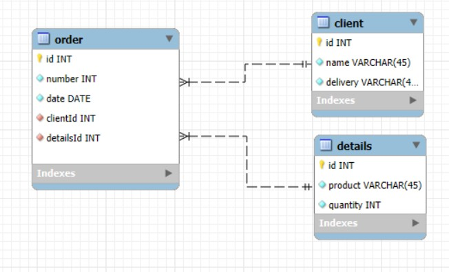
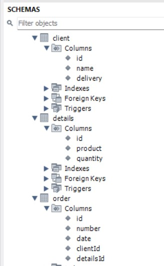

# goit-rdb-hw-02

1. Переведіть початкову таблицю в першу нормальну форму.

   

   Результат:

   

2. Переведіть нові таблиці в другу нормальну форму.

   Результат:

   

3. Переведіть нові таблиці в третю нормальну форму.

   Результат:

   

4. Розробіть ER-діаграму отриманих таблиць.

💡 Використовуйте зрозумілі та конкретні імена для сутностей та атрибутів. Уточнюйте типи даних для атрибутів. Перевірте, чи всі відношення й атрибути мають чіткі і зрозумілі кардинальності та значення.

5. Використовуючи ER-діаграму, створіть таблиці в базі даних. Оформіть ці таблиці без конкретних значень, тільки з урахуванням колонок та їхніх зв'язків, вручну або автоматично.

   Результат:

   
